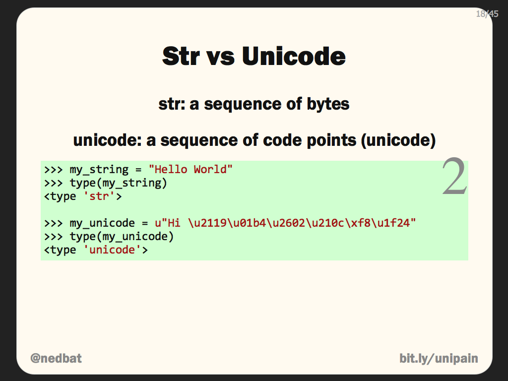
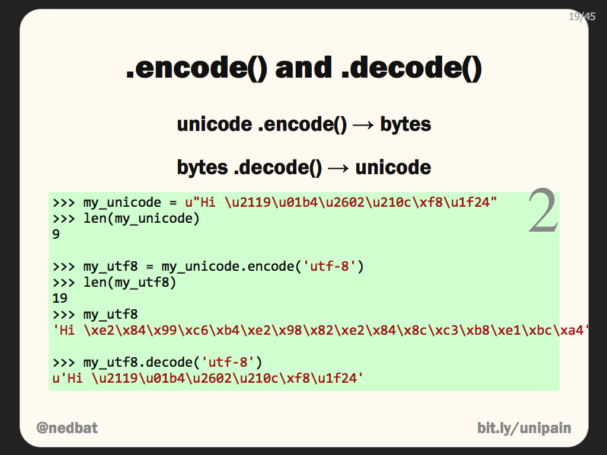
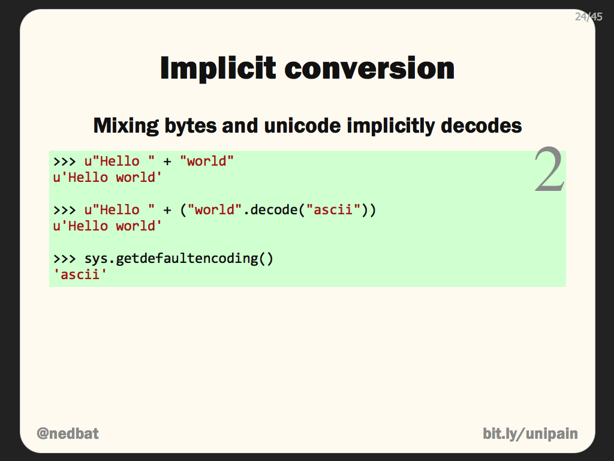
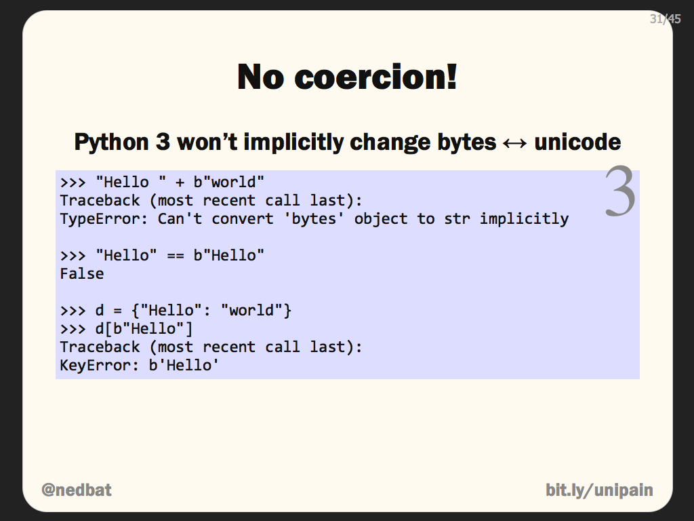
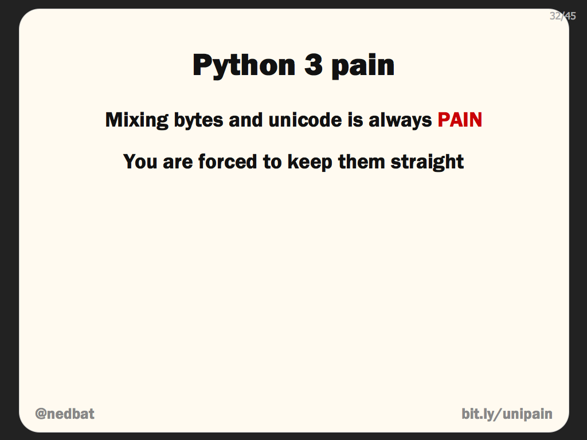
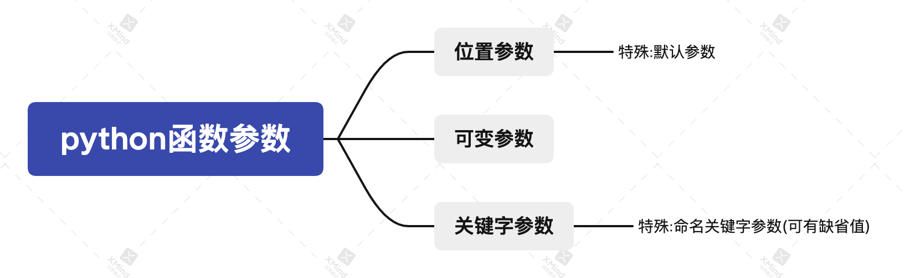
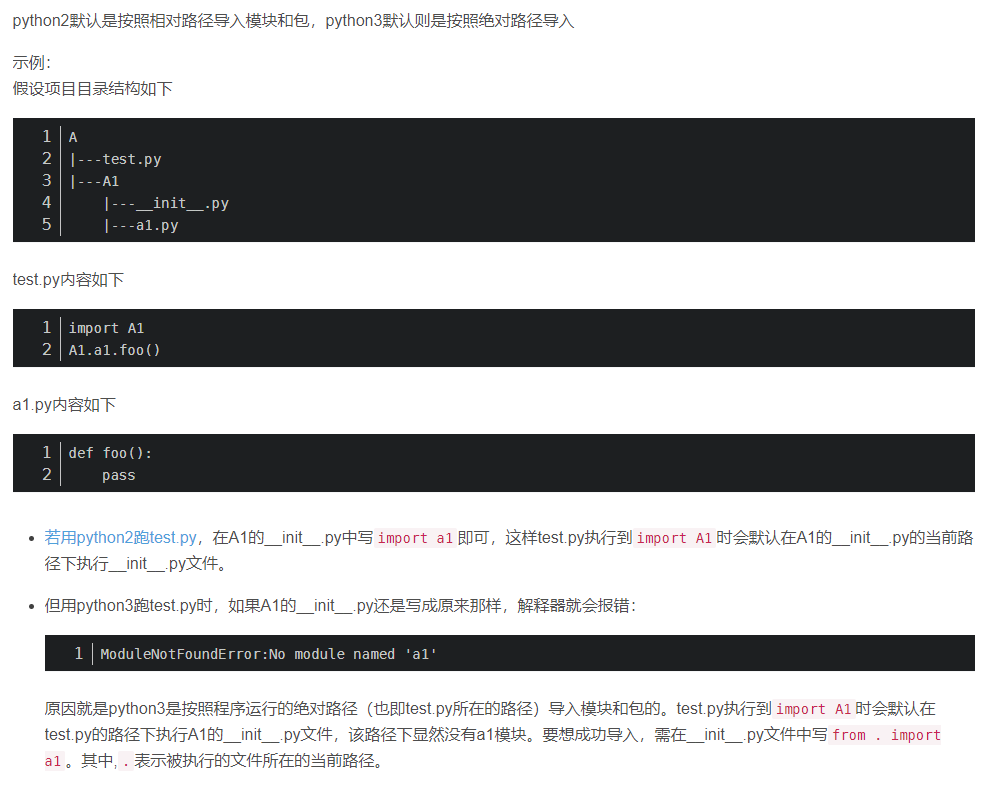

<!-- START doctoc generated TOC please keep comment here to allow auto update -->
<!-- DON'T EDIT THIS SECTION, INSTEAD RE-RUN doctoc TO UPDATE -->
**Table of Contents**  *generated with [DocToc](https://github.com/thlorenz/doctoc)*

- [字符串](#%E5%AD%97%E7%AC%A6%E4%B8%B2)
  - [python2](#python2)
    - [str](#str)
    - [unicode](#unicode)
  - [python3](#python3)
    - [str](#str-1)
    - [bytes](#bytes)
  - [规则总结](#%E8%A7%84%E5%88%99%E6%80%BB%E7%BB%93)
- [函数的参数](#%E5%87%BD%E6%95%B0%E7%9A%84%E5%8F%82%E6%95%B0)
- [生成器与迭代器](#%E7%94%9F%E6%88%90%E5%99%A8%E4%B8%8E%E8%BF%AD%E4%BB%A3%E5%99%A8)
  - [生成器(generator)](#%E7%94%9F%E6%88%90%E5%99%A8generator)
  - [迭代器(Iterator)](#%E8%BF%AD%E4%BB%A3%E5%99%A8iterator)
- [with](#with)
- [阻塞、非阻塞，同步、异步](#%E9%98%BB%E5%A1%9E%E9%9D%9E%E9%98%BB%E5%A1%9E%E5%90%8C%E6%AD%A5%E5%BC%82%E6%AD%A5)
- [coroutine](#coroutine)
- [命名空间和作用域](#%E5%91%BD%E5%90%8D%E7%A9%BA%E9%97%B4%E5%92%8C%E4%BD%9C%E7%94%A8%E5%9F%9F)
- [类方法 静态方法 实例方法](#%E7%B1%BB%E6%96%B9%E6%B3%95-%E9%9D%99%E6%80%81%E6%96%B9%E6%B3%95-%E5%AE%9E%E4%BE%8B%E6%96%B9%E6%B3%95)
  - [Python 类中的方法大致可以分为三种：](#python-%E7%B1%BB%E4%B8%AD%E7%9A%84%E6%96%B9%E6%B3%95%E5%A4%A7%E8%87%B4%E5%8F%AF%E4%BB%A5%E5%88%86%E4%B8%BA%E4%B8%89%E7%A7%8D)
  - [访问方式](#%E8%AE%BF%E9%97%AE%E6%96%B9%E5%BC%8F)
  - [特性](#%E7%89%B9%E6%80%A7)
  - [典型应用场景](#%E5%85%B8%E5%9E%8B%E5%BA%94%E7%94%A8%E5%9C%BA%E6%99%AF)
  - [继承类中的区别](#%E7%BB%A7%E6%89%BF%E7%B1%BB%E4%B8%AD%E7%9A%84%E5%8C%BA%E5%88%AB)
- [python2与python3区别总结](#python2%E4%B8%8Epython3%E5%8C%BA%E5%88%AB%E6%80%BB%E7%BB%93)
  - [字典keys()](#%E5%AD%97%E5%85%B8keys)
  - [实现单例有区别](#%E5%AE%9E%E7%8E%B0%E5%8D%95%E4%BE%8B%E6%9C%89%E5%8C%BA%E5%88%AB)
  - [basestring](#basestring)
  - [默认编码方式](#%E9%BB%98%E8%AE%A4%E7%BC%96%E7%A0%81%E6%96%B9%E5%BC%8F)
  - [reload函数](#reload%E5%87%BD%E6%95%B0)
  - [字典遍历 items()和iteritems()](#%E5%AD%97%E5%85%B8%E9%81%8D%E5%8E%86-items%E5%92%8Citeritems)
  - [str()](#str)
  - [import](#import)
- [pip命令](#pip%E5%91%BD%E4%BB%A4)
- [python填坑记录](#python%E5%A1%AB%E5%9D%91%E8%AE%B0%E5%BD%95)
  - [版本差异](#%E7%89%88%E6%9C%AC%E5%B7%AE%E5%BC%82)

<!-- END doctoc generated TOC please keep comment here to allow auto update -->


# 字符串

参考: [Unicode之痛](https://pycoders-weekly-chinese.readthedocs.io/en/latest/issue5/unipain.html)

## python2







### str
- 理解：a sequence of bytes，存储bytes
- bytes.decode()——>unicode
  *  不论bytes.decode("utf-8")还是bytes.decode("ascii")，结果都是unicode。decode的参数决定字节串以何种编码方式(utf-8/ascii)被解码为对应的unicode字符。所以，如果字节串使用ascii解码，且字节串中包含utf-8编码的非ascii字符，那么会产生UnicodeDecodeError错误。因为ASCII只接受127内的值。
  *  上图“Implicit conversion”中，把Unicode字符串和byte字符串组合起来，Python2将会自动的将byte串来解码成unicode字符串，从而产生一个新的Unicode字符串。如图所示，想要连接Unicode串“hello ”和一个byte字符串“world”，结果是一个Unicode的“hello world”。这是因为Python2将“world”使用ASCII codec进行了解码。这次解码中使用的字符集的值与sys.getdefaultencoding()的值相等。这些隐藏的编码转换不能免疫于解码错误。如果你想要连接一个byte字符串和一个unicode字符串，并且byte字符串不能被解码成ASCII的话，将会抛出一个UnicodeDecodeError。代码中包含了unicode和byte字符串，只要数据全部是ASCII的话，所有的转换都是正确的，一旦一个非ASCII字符偷偷进入程序，那么默认的解码将会失败，从而造成UnicodeDecodeError的错误。
  *  简单的去打印出一个unicode字符串将会调用隐式的编码：输出总会是 bytes，所以在unicode被打印之前必须被编码成byte串。(注意：是打印的结果是bytes，也就是显示出来给人看的是bytes，并非这个字符串本身类型发生变化，通过type(unicode_str)函数获取的并不是打印结果的类型，而是该字符串本身的类型)
### unicode
- 理解：a sequence of code points，存储code points
- unicode.encode()——>bytes
- UNICODE 的字符被称为代码点(CODE POINTS，实质为整数)。

```python
# -*- coding: UTF-8 -*-
import sys

print(sys.getdefaultencoding()) #ascii

a = u"hello "
b = "world"
print(a, b, type(a), type(b))

c = a + b
print(c, type(c))

d = b.decode("utf-8")
print(d, type(d))

e = b.decode("ascii")
print(e, type(e))

f = "世界"
print(f, type(f))

# g = a + f.decode("ascii") #decode("ascii")等同于不加,会报错
# print(g, type(g))

h = a + f.decode("utf-8") #这里不加decode是不行的
print(h, type(h))
```

## python3



### str

- 理解：存储unicode，等同于python2中的unicode。
- Python3中对Unicode支持的最大变化就是没有对byte字符串的自动解码。如果你想要用一个byte字符串和一个unicode相连接的话，你会得到一个错误，不管包含的内容是什么。所有这些在Python2中都有隐式的处理，而在 Python3中你将会得到一个错误。
- 如果一个Unicode字符串和byte字符串中包含的是相同的ASCII码，Python2中将认为两个是相等的，而在Python3中不会。这样做的结果是Unicode中的键不能找到byte字符串中的值，反之亦然，然而在Python2中是可行的。
- 在Python2中，只要你使用ASCII数据，那么混合Unicode和byte将会成功，而在Python3会直接忽略数据而失败。这样的话，在Python2中所遇到的，你认为你的程序是正确的但是最后发现由于一些特殊字符而失败的错误就会避免。Python3中，你的程序马上就会产生错误，所以即使你处理的是ASCII码，那你也必须处理bytes和Unicode之间的关系。Python3中对于bytes和unicode的处理非常严格，你被迫去处理这些事情。
- 这样处理的原因之一是对读取文件的变化，Python对于读取文件有两种方式，一种是二进制，一种是文本。在Python2中，它只会影响到行尾符号，甚至在Unix系统上的时候，基本没有区别。在Python3中，这两种模式将会返回不同的结果。当你用文本模式打开一个文件时不管你是用的“r”模式或者默认的模式，读取成功的文件将会自动转码成unicode，你会得到str对象。如果你用二进制模式打开一个文件，在参数中输入“rb”，那么从文件中读取的数据会是bytes，对它们没有任何处理。隐式的对bytes到unicode的处理使用的是locale.getpreferedencoding()，然而它有可能输出你不想要的结果。比如，当你读取hi_utf8.txt时，他被解码成语言偏好中所设置的编码方式，如果我们这些例子在Windows中创建的话，那么就是“cp1252”。像ISO8859-1，CP-1252这些可以得到任意的byte值，所以不会抛出UnicodeDecodeError，当然也意味着它们会直接将数据解码成CP-1252，制造出我们并不需要的垃圾信息。为了文件读取正确的话，你应该指明想要的编码。open函数现在已经可以通过参数来指明编码。

### bytes

- 理解：存储byte串，等同于python2中的str。

## 规则总结



1. 在程序中进进出出的只有bytes，但是程序中不必处理所有的bytes。最好的策略是将输入的bytes马上解码成unicode。你在程序中均使用unicode，当在进行输出的时候，尽早将之编码成bytes。制造一个Unicode三明治，bytes在外，Unicode在内。
2. 需要知道现在处理的是哪种类型的数据。在程序中任何一个位置，需要知道处理的是byte串还是一个unicode串。它不能是一种猜测，而应该被设计好。另外，如果有一个byte串的话，想对它进行处理，那么应该知道它是怎样的编码。同样的bytes流通过不同的解码器是可能解码的。而bytes本身不能指明它自己用的哪种编码方式。
3. 个人一点思考：字符串前缀u是python2中使用，前缀b为python3中使用。

# 函数的参数

参考: [函数的参数 - 廖雪峰的官方网站](https://www.liaoxuefeng.com/wiki/1016959663602400/1017261630425888)



tips: **默认参数必须指向不变对象！**

参考: [好冷的Python~默认参数、可变对象和不可变对象](http://www.juzicode.com/python-cold-default-variable-immutable-parameter/)

```python
# 参数为可变对象
def mutable_obj(l=[]):
    l.append("a")  # l变量指向的对象不变
    return l
# 参数为不可变对象
def immutable_obj(a="a"):
    a += "b"  # a变量指向的对象已发生变化
    return a
# 默认参数会在解释器执行到函数定义时创建好(不管是可变还是不可变对象)。如果默认参数为可变对象,那么对这个可变对象的修改会在多次调用间传递。
a = mutable_obj()
b = mutable_obj()
if id(a) == id(b):
    print("yes")
c = immutable_obj()
d = immutable_obj()
if id(c) == id(d):
    print("yes")
```
# 生成器与迭代器

参考: [生成器 - 廖雪峰的官方网站](https://www.liaoxuefeng.com/wiki/1016959663602400/1017318207388128)

## 生成器(generator)

1. 一边循环一边计算的机制，称为生成器。generator保存的是算法。

2. 创建生成器两种办法：

   + 将列表生成式的`[]`改成`()`，就创建了一个generator对象。

     ```python
     >>> L = [x * x for x in range(10)]
     >>> L
     [0, 1, 4, 9, 16, 25, 36, 49, 64, 81]
     >>> g = (x * x for x in range(10))
     >>> g
     <generator object <genexpr> at 0x1022ef630>
     ```

   + 生成器函数：如果一个函数定义中包含`yield`关键字，那么这个函数就不再是一个普通函数，而是一个generator。***generator和函数的执行流程不一样。函数是顺序执行，遇到`return`语句或者最后一行函数语句就返回。而变成generator的函数，在每次调用`next()`的时候执行，遇到`yield`语句返回，再次执行时从上次返回的`yield`语句处继续执行。***

     ```python
     # 调用generator函数就可以生成generator对象
     # f = fib(5),变量f的值就是一个generator对象
     def fib(max):
         n, a, b = 0, 0, 1
         while n < max:
             yield b
             a, b = b, a + b
             n = n + 1
         return 'done'
     ```
   
3. 生成器的使用方式：
   
   - ***调用generator函数，首先生成一个generator对象***，然后用`next()`函数不断获得下一个返回值。使用类似列表生成式创建的generator对象也是可以用next()函数的。

     ```python
     f = fib(6)
     print(next(f))
     print(next(f))
     ...
     ```
     
   - 使用`for`循环来迭代（被迭代的也是generator对象）
   
     ```python
     for i in fib(6):
         print(i)
     ```

     总结：生成器不但可以作用于for循环，还可以被next()函数不断调用并返回下一个值，直到最后抛出StopIteration错误表示无法继续返回下一个值了。
   
## 迭代器(Iterator)

1. 可迭代对象(Iterable)：可以直接作用于`for`循环的对象
   - 一类是集合数据类型，如`list`、`tuple`、`dict`、`set`、`str`等；
   - 一类是`generator`，包括生成器和带`yield`的generator function。
2. 迭代器：可以被`next()`函数调用并不断返回下一个值的对象，表示一个惰性计算的序列。
3. 生成器都是`Iterator`对象，但`list`、`dict`、`str`虽然是`Iterable`，却不是`Iterator`。
4. 把`list`、`dict`、`str`等`Iterable`变成`Iterator`可以使用`iter()`函数。
5. Python的`for`循环本质上就是通过不断调用`next()`函数实现的。

# with

1. 工作原理：

   - 紧跟with后面的语句被求值后，返回对象的`__enter__()`方法被调用，这个方法的返回值将被赋值给as后面的变量

   - 当with后面的代码块全部被执行完之后，将调用前面返回对象的`__exit__()`方法

   ```python
   class Sample:
       def __enter__(self):
           print("in __enter__")
           return "Foo"
       def __exit__(self, exc_type, exc_val, exc_tb):
           print("in __exit__")
   def get_sample():
       return Sample()
   with get_sample() as sample:
       print("Sample: ", sample)
   ```

   ```python
   class Sample:
       def __enter__(self):
           print('in enter')
           return self
       def __exit__(self, exc_type, exc_val, exc_tb):
           print("type: ", exc_type)
           print("val: ", exc_val)
           print("tb: ", exc_tb)
       def do_something(self):
           bar = 1 / 0
           return bar + 10
   with Sample() as sample:
       sample.do_something()
   ```

   注意：***执行的`__enter__()`和`__exit__()`方法为with后面语句执行后所返回对象的方法，as后变量接收的值为`__enter__()`方法的返回值。***

2. 任何对象，只要正确实现了上下文管理，就可以用于`with`语句。实现上下文管理是通过`__enter__`和`__exit__`这两个方法实现的。

3. 如果一个对象没有实现上下文，我们就不能把它用于`with`语句。这个时候，可以用`closing()`来把该对象变为上下文对象。

# 阻塞、非阻塞，同步、异步

来源: [异步IO](https://www.liaoxuefeng.com/discuss/969955749132672/1130545526362016)

老张爱喝茶，废话不说，煮开水。 出场人物：老张，水壶两把（普通水壶，简称水壶；会响的水壶，简称响水壶）。1 老张把水壶放到火上，立等水开。（同步阻塞） 老张觉得自己有点傻 2 老张把水壶放到火上，去客厅看电视，时不时去厨房看看水开没有。（同步非阻塞）老张还是觉得自己有点傻，于是变高端了，买了把会响笛的那种水壶。水开之后，能大声发出嘀~~~~的噪音。 3 老张把响水壶放到火上，立等水开。（异步阻塞） 老张觉得这样傻等意义不大 4 老张把响水壶放到火上，去客厅看电视，水壶响之前不再去看它了，响了再去拿壶。（异步非阻塞） 老张觉得自己聪明了。

所谓同步异步，只是对于水壶而言。 普通水壶，同步；响水壶，异步。 虽然都能干活，但响水壶可以在自己完工之后，提示老张水开了。这是普通水壶所不能及的。 同步只能让调用者去轮询自己（情况2中），造成老张效率的低下。

所谓阻塞非阻塞，仅仅对于老张而言。 立等的老张，阻塞；看电视的老张，非阻塞。 情况1和情况3中老张就是阻塞的，媳妇喊他都不知道。虽然3中响水壶是异步的，可对于立等的老张没有太大的意义。所以一般异步是配合非阻塞使用的，这样才能发挥异步的效用。

理解：老张相当于是cpu，主调的一方；水壶烧水相当于单个线程，被调的一方。阻塞非阻塞以cpu视角看，同步异步以单一线程的视角看。cpu不用等io结果，而是去执行其他线程，就是非阻塞。

# coroutine

1. yield from code(): 让code()以异步非阻塞的方式执行；不使用yield from会是同步阻塞。code()代指常见的io操作等，使用yield from会让出cpu，以便执行其他协程，所以是非阻塞的。执行完后，会通知cpu执行结果，该协程也会再次获得执行权，所以是异步的。协程并发执行时，如果单个协程内部有io操作时，不使用yield from，该协程会持续占用cpu，直到执行结束才会释放，并发无法实现。yield from code()对于其所在的协程来说，仍然是一行顺序执行的代码，只有code()返回，才会继续执行该协程后面的代码。

# 命名空间和作用域
1. Python中只有模块（module），类（class）以及函数（def、lambda）才会引入新的作用域，其它的代码块（如if/elif/else/、try/except、for/while等）是不会引入新的作用域的，也就是说这些语句内定义的变量，外部也可以访问。(参考:[Python3 命名空间和作用域](https://www.runoob.com/python3/python3-namespace-scope.html))

# 类方法 静态方法 实例方法

来源: [类方法 静态方法和实例方法](https://note-zw.readthedocs.io/zh/latest/Python/%E7%B1%BB%E6%96%B9%E6%B3%95%E9%9D%99%E6%80%81%E6%96%B9%E6%B3%95%E5%92%8C%E5%AE%9E%E4%BE%8B%E6%96%B9%E6%B3%95.html)

## Python 类中的方法大致可以分为三种：

- 类方法
- 实例方法
- 静态方法

```python
class Foo(object):
    def test1(self):
        '''
        定义了实例方法
        '''
        print('instance {}'.format(self))

    @classmethod
    def test2(cls):
        '''
        定义了类方法
        '''
        print('class {}'.format(cls))

    @staticmethod
    def test3(n):
        '''
        定义了静态方法
        '''
        print('static n = {}'.format(n))
```

## 访问方式

- 实例方法：通过实例和类进行访问，通过类访问需要手动绑定实例

  ```python
  s = Foo()
  s.test1()
  Foo.test1(s)
  ```

  ```python
  instance <__main__.Foo object at 0x00000236651661D0>
  instance <__main__.Foo object at 0x00000236651661D0>
  ```

- 类方法：通过类或者实例进行访问。因为通过实例可以反推得到类，所以可以进行访问。

  ```python
  s = Foo()
  Foo.test2()
  s.test2()
  ```

  ```python
  class <class '__main__.Foo'>
  class <class '__main__.Foo'>
  ```

- 静态方法：通过类或者实例进行访问

  ```python
  s = Foo()
  Foo.test3(5)
  s.test3(5)
  ```

  ```python
  static n = 5
  static n = 5
  ```

## 特性

- 实例方法 需要绑定实例才能运行。如果未绑定的方法 Foo.test1 不传实例对象给 self 时，就会报参数缺失错误，python2 要求第一个参数self是实例对象，而 python3 中可以是任意对象。

    ```python
    >>> Foo.test1
    <function __main__.Foo.test1>
    >>> s = Foo()
    >>> s.test1
    <bound method Foo.test1 of <__main__.Foo object at 0x00000236651379B0>>
    ```

- 类方法 无论通过类还是实例进行访问，都会自动绑定类
- 静态方法 类里面的一个普通函数，与类和实例都没有绑定关系，只是存在于类中为类服务，静态方法如果作为全局函数也不会有什么问题。

## 典型应用场景

- 类方法 作为工厂方法创建实例对象，例如内置模块 datetime.date 类中就有大量使用类方法作为工厂方法，以此来创建 date 对象。

  ```python
  class date:
      def __new__(cls, year, month=None, day=None):
          self = object.__new__(cls)
          self._year = year
          self._month = month
          self._day = day
          return self
  
      @classmethod
      def fromtimestamp(cls, t):
          y, m, d, * = _time.localtime(t)
          return cls(y, m, d)
  
      @classmethod
      def today(cls):
          t = _time.time()
          return cls.fromtimestamp(t)
  ```

  如果需要在类中调用静态方法，最好把方法定义成类方法，因为要是定义成静态方法，那么就要显示地引用类 Foo，这对继承来说不是一件好事。

  ```python
  class Foo:
  
      @staticmethod
      def m1():
          pass
  
      @staticmethod
      def m2():
          Foo.m1() # bad
  
      @classmethod
      def m3(cls):
          cls.m1() # good
  ```

- 静态方法 如果在方法中不需要访问任何实例方法和属性，纯粹地通过传入参数并返回数据，那么适合用静态方法，可以节省实例化对象的开销，通常这种方法放在类外面的模块层作为一个函数存在也是没问题的，而放在类中，仅为这个类服务。

## 继承类中的区别

[python类的静态方法和类方法区别](https://www.jianshu.com/p/212b6fdb2c50)

子类继承父类的方法，子类覆盖了父类的静态方法averag。子类的实例继承了父类的static_method静态方法，调用该方法，还是调用的父类的方法和类属性。子类的实例继承了父类的class_method类方法，调用该方法，调用的是子类的方法和子类的类属性。

```python
# coding:utf-8

class Foo(object):
    X = 1
    Y = 2

    @staticmethod
    def averag(*mixes):
        return sum(mixes) / len(mixes)

    @staticmethod
    def static_method():
        return Foo.averag(Foo.X, Foo.Y)

    @classmethod
    def class_method(cls):
        return cls.averag(cls.X, cls.Y)


class Son(Foo):
    X = 3
    Y = 5

    @staticmethod
    def averag(*mixes):
        return sum(mixes) / 3

p = Son()
print(p.static_method())
print(p.class_method())
# 1.5
# 2.6666666666666665
```

# python2与python3区别总结

## 字典keys()
   - py3: 返回一个可迭代对象(dict_keys)，可以使用 list() 来转换为列表
   - py2: 直接返回列表
## 实现单例有区别

   - py2

     ```python
     class Singleton(object):
         _instance = None
         def __new__(cls, *args, **kwargs):
             if not cls._instance:
                 cls._instance = super(Singleton, cls).__new__(cls, *args, **kwargs)
             return cls._instance
     ```

     

   - py3

     ```python
     class Singleton(object):
         _instance = None
         def __new__(cls, *args, **kwargs):
             if not cls._instance:
                 cls._instance = super(Singleton, cls).__new__(cls)
             return cls._instance
     ```

   - 理解:python中无法用`__init__`方法实现单例模式。`__init__`函数并不是真正意义上的构造函数，`__init__`方法做的事情是在对象创建好之后初始化变量。真正创建实例的是`__new__`方法。所以在`__init__`中试图创建单例是徒劳的，因为调用`__init__`前对象已经创建好了。另外与php不同的一点是，`__new__`作为构造方法，它是用于创建对象并返回对象，所以判断单例存在与否的逻辑可以放在其中。而php的构造方法是对象创建完成后第一个被对象自动调用的方法，php可以通过权限控制禁止外界访问其构造方法（虽说是创建后调用的，但是将构造方法私有就是可以阻止对象的创建），然后对外提供一个静态方法用于获取单例，判断单例存在与否的逻辑只能放在该静态方法中，不能放在构造方法中。python中没有办法做到实例化对象时不让访问`__new__`，所以类似php中由静态方法提供单例的方式是不可取的。两个语言的不同点主要是由于构造方法的执行时机与对象生成时机的先后顺序不同导致的。

     [参考:Python面试之理解`__new__`和`__init__`的区别](https://zhuanlan.zhihu.com/p/35943253)

## basestring

- Python3 不支持 basestring

## 默认编码方式

```python
import sys
print(sys.getdefaultencoding())
```

- py2--ascii

- py3--utf-8

## reload函数

- 在python2中，reload()是内置函数，能够直接使用。

- 在python3中，直接使用reload()会报错，需要从imp中导入。用法为

  ```python
  from imp import reload
  reload(xyz)
  ```

## 字典遍历 items()和iteritems()

- py2

  1. 命令dict.items()、dict.keys()和dict.values()返回字典中(k, v)对、键和值列表的副本。如果复制的列表很大，这可能会占用大量内存。

  2. 命令dict.iteritems()、dict.iterkeys()和dict.itervalues()通过字典的(k, v)对、键和值返回一个迭代器。

  3. 命令dict.viewitems()、dict.viewkeys()和dict.viewvalues()返回视图对象，可以反映字典的变化。(例如，如果在字典中添加一个项目或添加一个(k,v)对，则视图对象可以同时自动更改。)

  ```python
  d = {'one': 1, 'two': 2}
  print type(d.items())  # <type 'list'>
  print type(d.keys())  # <type 'list'>
  print type(d.iteritems())  # <type 'dictionary-itemiterator'>
  print type(d.iterkeys())  # <type 'dictionary-keyiterator'>
  print type(d.viewitems())  # <type 'dict_items'>
  print type(d.viewkeys())  # <type 'dict_keys'>
  ```
  
- py3

  1. 在py3.x中，情况更加干净，因为只有dict.items()、dict.keys()和dict.values()可用，它们返回视图对象，就像py2.x中的dict.viewitems()一样。
  2. 视图对象与迭代器不同，因此如果要在py3.x中返回迭代器，可以使用iter(dictview)。

  ```python
  d = {'one': '1', 'two': '2'}
  print(type(d.items()))  # <class 'dict_items'>
  print(type(d.keys()))  # <class 'dict_keys'>
  ii = iter(d.items())
  print(type(ii))  # <class 'dict_itemiterator'>
  ik = iter(d.keys())
  print(type(ik))  # <class 'dict_keyiterator'>
  ```

## str()

- py2中str代表字节序列，因而str(obj)返回的是字节序列

- py3中str代表unicode字符序列，所以str(obj)返回的是unicode字符序列

```python
d = {"name": "zhangsan", "age": 21}
print(type(str(d)), len(str(d)), str(d))
# 输出看似类型一样，本质是不同的
#py2 output: (<type 'str'>, 31, "{'age': 21, 'name': 'zhangsan'}")
#py3 output: <class 'str'> 31 {'name': 'zhangsan', 'age': 21}
```

## import

- py2: 默认是按照相对路径导入模块和包

- py3: 默认是按照绝对路径导入

  
  参考: [python2和python3 通过import导入模块和包的区别](https://blog.csdn.net/Blateyang/article/details/89492570) 
  [Python2和3在包内import时的语法差异问题](https://segmentfault.com/q/1010000000400151)

# pip命令
- 查看pip安装的软件包路径: `pip show requests`

# python填坑记录
## 版本差异
- 如下代码,`3.6.8`版本报错`SyntaxError: 'continue' not supported inside 'finally' clause`,`3.8.9`运行正常
  + [为什么在Python的`finally`子句中不允许`continue`？](https://www.thinbug.com/q/8302293)
  + [What’s New In Python 3.8 - Other Language Changes - 第一条](https://docs.python.org/3/whatsnew/3.8.html#other-language-changes)
  ```
  for i in range(10):
    print(i)
    try:
        pass
    except Exception as e:
        print(e)
    finally:
        continue
  ```